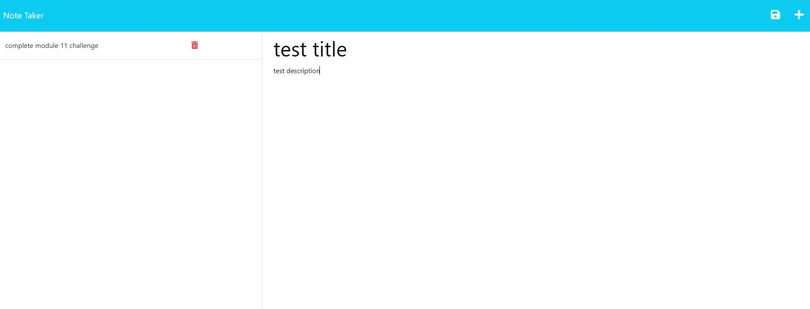

# Note Taker Application

## Description

This is a simple note-taking application which allows users to input tasks, choosing the title and description, and save them to the server. Users may also delete notes of their choosing.

## Usage/Preview

Users can access the application through the deployment link on Heroku, listed below.

To get started, users can input any title and description of their choosing; once the input is validated, a save button will be presented at the top right which can be clicked to save the current note to the sidebar. The sidebar presents a running list of notes retrieved from the server.

Clicking any of the notes in the sidebar will display the note in a read-only format.

Users can then delete any note by clicking the 'delete' icon next to the corresponding note in the sidebar.

Heroku link: https://thawing-plateau-04859-2c4e70d8255a.herokuapp.com/

## Technologies Used
* Express.js
* uuid for generating note IDs
* Heroku

## Credits

Front-end developed with starter code provided by The Coding Boot Camp @ UCSD.

## License

N/A